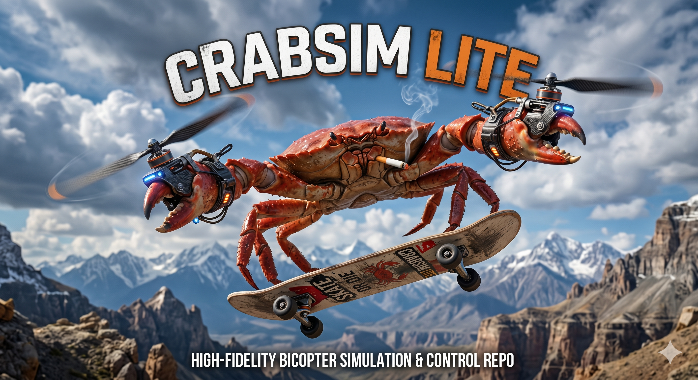

# CrabSim Lite



CrabSim Lite is a lightweight, Python-based dynamics simulation environment designed for modeling rigid bodies equipped with rotors, focusing primarily on bicopter configurations. It provides a modular approach to simulating complex interactions between body motion, rotor reaction torques, tilting actuator dynamics, and thrust-generated moments.

## Purpose

The primary goal of CrabSim Lite is to capture the major dynamics of an RC, ~1-2kg bicopter (crabcopter) to facilitate experimentation with high-performance Guidance, Navigation, and Control (GNC) algorithms. This includes rate control, control allocation, and closed-loop testing before real-world deployment.

## Features

- **Rigid Body Dynamics:** Simulate 6-DOF (currently focused on 3-DOF angular) dynamics of a rigid body using a robust Runge-Kutta 4th order (RK4) integrator.
- **Advanced Rotor Modeling:** Supports modeling rotors as both reaction wheels (for gyroscopic and reaction torques) and thrusters (for thrust-generated moments).
- **GNC System Integration:** 
    - **PID Control:** Configurable 3-axis PID controllers for rate management with anti-windup.
    - **Control Allocation:** Sophisticated mixing logic that maps desired 3-axis moments and throttle requests to specific motor speeds and servo angles. Computes maximum actuation authority dynamically to avoid control saturation.
- **YAML Configuration:** Easy parameterization of physical properties, actuator limits, and PID gains without modifying source code.
- **Data Logging & Visualization:** Built-in logging to CSV and sophisticated PDF plotting tools to compare commanded vs. actual states.

## Plant Assumptions & Modeling Simplifications

To balance simulation speed with fidelity for ~1-2kg RC scale vehicles, CrabSim Lite employs several explicit plant assumptions in its physical models (`plants.py`):

1. **Servo kinematics are independent of vehicle dynamics:** Servo angles and rates are strictly governed by their internal first-order transfer functions and are not affected by external aerodynamic loads or the vehicle's motion. On an RC scale, servos are highly geared and powerful enough that this is generally representative of real performance.
2. **Motor kinematics are independent of vehicle dynamics:** Motor spin rates and accelerations are assumed to follow their own independent first-order transfer function models and are not slowed down by vehicle maneuvers or opposing airflow. This is a valid approximation given the torque of powerful brushless motors typical at this scale.
3. **Tilting mechanisms are massless (zero inertia):** The simulation models the gyroscopic inertia of the spinning rotor (`H_rotor`), but assumes the actual physical tilting mechanism (the servo arm, mount, and motor housing) has no inertia (`H_tilt = 0`). This is practically valid because in practice $H_{rotor} \gg H_{tilt}$, meaning the gyroscopic forces dominate the actuator dynamics.

## Repository Structure

- **Simulation Core:**
  - `plants.py`: Physical plant models for simple rigid bodies, rotors, and the composite `bicopter` assembly.
  - `gnc.py`: GNC system components including the `smart_PID` controller, control `allocator`, and main `gnc` loop.
  - `integrator.py`: Numerical integration utilities (RK4).
  - `tf.py`: Contains basic transfer functions used for actuator models.
  - `util.py`: Math and physics utility functions (unit conversions, inertia tensors, 1D lookups).
- **Simulation Scripts:**
  - `sim_cl.py`: Closed-loop simulation script demonstrating autonomous GNC stabilization and tracking.
  - `sim_ol.py`: Open-loop simulation for manual actuator commands or basic step-response testing.
- **Tools & Utilities:**
  - `verify_allocator.py`: Validation script for testing control allocation logic independently.
  - `sympy_alloc.py`: Script using SymPy to symbolically derive the inverse allocation matrix.
  - `csv_to_pdf.py` / `csv_to_pdf_smart.py`: Parsing and plotting scripts to turn `log.csv` into detailed PDF visualizations (e.g., `log_smart.pdf`).
- **Configuration (YAML):**
  - `crabcopter.yaml`: Physical dimensions, mass properties, and hardware specifications (motor/servo time constants).
  - `crabcopter_gnc.yaml`: Configuration for the allocator constraints (geometry and motor mapping).
  - `smart_PID.yaml`: Controller configuration including PID gains and integral limits for the X, Y, and Z axes.

## Installation & Quick Start

1. **Clone the repository & Install Dependencies:**
   Ensure you have Python 3 installed. Install the required packages:
   ```bash
   pip install -r requirements.txt
   ```

2. **Run a Closed-Loop Simulation:**
   Execute `sim_cl.py` to run the default simulation scenario.
   ```bash
   python sim_cl.py
   ```
   This generates a `log.csv` file containing the state history.

3. **Visualize the Results:**
   Use the smart post-processing script to generate performance plots.
   ```bash
   python csv_to_pdf_smart.py
   ```
   Open the generated `log_smart.pdf` to see the commanded versus actual rates, forces, and moments over time.

---

*CrabSim Lite - Developed for high-fidelity, lightweight dynamics research.*
